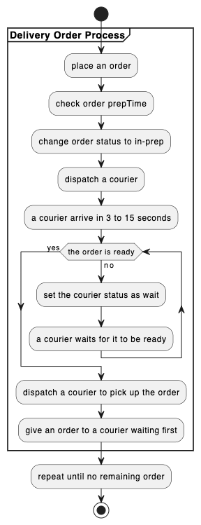

# CSS Order System

### How to run code
1. Go to src/main/kotlin/com/css/assignment/CssAssignmentApplication.kt file and run via Intellij IDEA

2. After compilation, src/main/kotlin/com/css/assignment/helper/AppStartupRunner.kt file will initiate src/main/kotlin/com/css/assignment/service/DeliveryService.kt class and run whole methods.

### Diagram
check css-delivery-order.wsd file

### Design Pattern
I've tried to use basic MVC pattern but there's no REST API or DB as you required.
